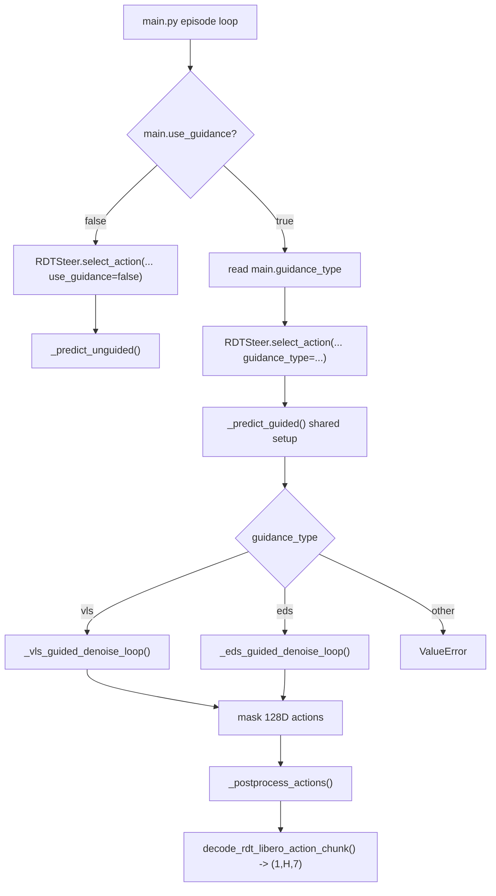

# RDT EDS Guidance Integration Design Proposal

Date: 2026-06-06
Worktree: `.worktrees/feat/rdt_ed_steering_integration`
Stage: brainstorming and code-level design only
Target command:

```bash
python main.py policy.type=rdt main.use_guidance=true main.guidance_type=eds
```

Existing VLS command that must remain behavior-compatible:

```bash
python main.py policy.type=rdt main.use_guidance=true main.guidance_type=vls
```

## 1. Scope

This proposal designs how to add EDS, short for Evolutionary Diffusion Steering, as a peer guidance mechanism for the existing RDT-LIBERO inference path. It intentionally does not implement runtime code.

Allowed implementation phase later: modify `main.py`, `configs/*.yaml`, `core/rdt_policy_steer.py`, and focused tests.

Not allowed in this design phase: modifying runtime code, third-party reference code, checkpoint files, or running GPU/benchmark jobs.

## 2. Inspected Files and Findings

| File | Finding | Evidence |
| --- | --- | --- |
| `main.py` | RDT is created only when `policy.type == 'rdt'`, using local checkpoint and encoder paths from `policy.rdt`. | `main.py:157-193` |
| `main.py` | RDT bypasses LeRobot pre/post processors because `RDTSteer` owns obs/action conversion internally. | `main.py:200-220` |
| `main.py` | Guidance state is currently controlled by `main.use_guidance` plus stage/keypoint availability. There is no `guidance_type` dispatch. | `main.py:625-690` |
| `configs/config.yaml` | `main` contains VLS-style guidance knobs and FKD config, but no `guidance_type` or EDS config. | `configs/config.yaml:35-55` |
| `configs/policy.yaml` | `policy.rdt` already carries RDT-specific checkpoint, encoder, horizon, and debug settings. | `configs/policy.yaml:32-43` |
| `core/rdt_policy_steer.py` | `_RDTDiTAdapter.forward()` supports full `(B, H, 128)` latent denoising and expands single-context conditioning to particle batch size. | `core/rdt_policy_steer.py:249-318` |
| `core/rdt_policy_steer.py` | `encode_inputs()` builds RDT conditions once: SigLIP image tokens, T5 language tokens, 128D state, action mask, control frequency, action indices. | `core/rdt_policy_steer.py:381-492` |
| `core/rdt_policy_steer.py` | `select_action()` has a generic guided entry but no `guidance_type`; all guided RDT calls go to `_predict_guided()`. | `core/rdt_policy_steer.py:940-1010` |
| `core/rdt_policy_steer.py` | `_predict_guided()` currently performs shared setup and then unconditionally calls `_guided_denoise_loop()`. This makes `_guided_denoise_loop()` the de facto VLS implementation. | `core/rdt_policy_steer.py:1052-1120` |
| `core/rdt_policy_steer.py` | `_guided_denoise_loop()` mixes VLS gradient guidance, diversity, optional FKD resampling, particle selection, and visualization candidate caching. | `core/rdt_policy_steer.py:1199-1309` |
| `core/rdt_policy_steer.py` | Existing reward scoring converts `(B,64,128)` particles to LIBERO EEF trajectories through `_rdt_sample_to_trajectory_3d()`. | `core/rdt_policy_steer.py:1139-1166`, `core/rdt_policy_steer.py:1380-1402` |
| `core/rdt_libero_action_converter.py` | LIBERO RDT action decode selects 7 active slots `[39, 40, 41, 42, 43, 44, 10]`, then binarizes gripper. | `core/rdt_libero_action_converter.py:6-42` |
| `core/rdt_libero_action_converter.py` | Final RDT action postprocess expects `(B,64,128)` and executes only particle 0 over `action_chunk_horizon`. | `core/rdt_libero_action_converter.py:45-62` |
| `core/rdt_libero_obs_processor.py` | LIBERO observation processor maintains two-frame image history and builds 128D state/mask from joint and gripper qpos. | `core/rdt_libero_obs_processor.py:74-114`, `core/rdt_libero_obs_processor.py:131-161` |
| `core/env_adapters/libero_adapter.py` | Guidance scoring currently projects normalized delta actions to an approximate EEF trajectory using `ACTION_SCALE_POS = 0.01`. | `core/env_adapters/libero_adapter.py:1542-1591` |
| `tests/test_rdt_steer.py` | Existing CPU tests already stub the RDT model, scheduler, and LIBERO adapter, making EDS route tests feasible without real checkpoint/GPU. | `tests/test_rdt_steer.py:1-120` |
| `tests/test_rdt_steer.py` | Existing tests cover guided particle batch size, diversity, FKD, non-finite handling, visualization candidates, and best-first ordering for VLS. | `tests/test_rdt_steer.py:396-668` |
| `third_party/RoboticsDiffusionTransformer-diffusion-es/scripts/maniskill_model.py` | Reference branch routes `use_diffusion_es=True` through `self.policy.run_diffusion_es()` inside the ManiSkill wrapper. | `third_party/RoboticsDiffusionTransformer-diffusion-es/scripts/maniskill_model.py:328-350`, `third_party/RoboticsDiffusionTransformer-diffusion-es/scripts/maniskill_model.py:566-585` |
| `third_party/RoboticsDiffusionTransformer-diffusion-es/models/rdt_runner.py` | Reference `run_diffusion_es()` is population/CEM-style and ManiSkill-specific; it uses `MANISKILL_INDICES`, `DATA_STAT`, hard-coded constraints, and `renoise()`/`rollout()` helpers. | `third_party/RoboticsDiffusionTransformer-diffusion-es/models/rdt_runner.py:278-504`, `third_party/RoboticsDiffusionTransformer-diffusion-es/models/rdt_runner.py:570-664` |

Important drift note: the prior analysis document records an active early return at `third_party/RoboticsDiffusionTransformer-diffusion-es/models/rdt_runner.py:388-389` (`docs/02_analysis/ed_guidance/rdt_diffusion_es_guidance_analysis.md:13-21`). The currently inspected source has the return line commented at the same location. Implementation should re-check this before citing "active path" behavior. The integration decision is: do not directly call the third-party `run_diffusion_es()` or import its ManiSkill action semantics, but do preserve its parameter semantics and core algorithmic steps through local RDTSteer glue code.

## 3. Correct Conceptual Model

EDS is not a replacement for FKD inside VLS. EDS and VLS are peer-level guided action generation mechanisms. The first implementation target is RDT-LIBERO, but the config and `select_action()` boundary should be policy-independent so the same steering mechanisms can later be tested on other policies.

Correct dispatch:

```text
use_guidance=false
  -> RDTSteer._predict_unguided()

use_guidance=true, guidance_type=vls
  -> RDTSteer._predict_guided()
  -> RDTSteer._vls_guided_denoise_loop()
  -> VLS gradient guidance, diversity, optional FKD

use_guidance=true, guidance_type=eds
  -> RDTSteer._predict_guided()
  -> RDTSteer._eds_guided_denoise_loop()
  -> EDS population sampling, cost scoring, resampling, renoise, rollout denoise, best selection
```

Design rule: rename the current VLS implementation from `_guided_denoise_loop()` to `_vls_guided_denoise_loop()`. Do not add EDS branches inside the VLS loop.

## 4. Proposed Call Graph



## 5. Dataflow Boundaries

EDS should operate in the same internal tensor space as VLS:

| Boundary | Input | Output | Rule |
| --- | --- | --- | --- |
| Observation | LIBERO raw obs | `RDTLiberoObservation` | Reuse existing image history, `state_128`, `state_mask_128`, and task processing. |
| Conditioning | `state_128`, `state_mask_128`, images, text embedding | `cond` dict with batch 1 | Reuse `_rdt_model.encode_inputs()` exactly once per new action chunk. Do not materialize repeated language/image/state conditions for EDS. |
| EDS particle state | `x_t` / population | `(B,64,128)` | Keep batch only in action latent/population space. Forward and rollout should expand `cond` from batch 1 to `B` when calling the model. |
| Scoring | `(B,64,128)` | rewards or costs `(B,)` | Reuse `_score_particles()` over LIBERO EEF trajectory projection when possible; convert reward to EDS cost only when the reference lower-is-better loop needs it. |
| Selection | candidate population | selected `(1,64,128)` | Return exactly one best particle for execution. |
| Decode | selected `(1,64,128)` | action chunk `(1,H,7)` | Reuse `_postprocess_actions()` and `decode_rdt_libero_action_chunk()`. |

## 6. Policy-Independent Configuration Design

Add a guidance selector under `main` and keep VLS/EDS parameter groups next to it, not under `policy.rdt`:

```yaml
main:
  use_guidance: false
  guidance_type: vls   # valid: vls, eds
```

Move the currently scattered VLS/FKD knobs into `main.vls_config`:

```yaml
main:
  vls_config:
    use_diversity: true
    sample_batch_size: 20
    guide_scale: 40.0
    diversity_scale: 10.0
    start_ratio: null
    MCMC_steps: 4
    use_fkd: true
    fkd:
      potential_type: max
      lmbda: 10.0
      adaptive_resampling: true
      resample_frequency: 5
```

Add `main.eds_config` using the same parameter names and defaults as `RDTRunner.run_diffusion_es()`:

```yaml
main:
  eds_config:
    population_size: 16
    use_cem: false
    cem_iters: 20
    num_elites: 32
    temperature: 0.1
    initial_population_cache: null
    ed_population_cache: null
    use_initial_cache: false
    save_initial_cache: false
    save_ed_cache: false
```

Rationale:

- `main.guidance_type` is the runtime switch requested by the target command.
- VLS remains the default to preserve current guided behavior.
- `vls_config` and `eds_config` are policy-independent steering configs. RDT consumes them first; other policies can later implement the same interface without moving config keys.
- FKD settings stay VLS-owned inside `vls_config`. EDS must not read VLS/FKD settings as a hidden steering replacement.
- EDS parameter names should match the reference signature (`population_size`, `use_cem`, `cem_iters`, `num_elites`, `temperature`, cache flags) rather than introducing invented names such as `iterations`, `elite_fraction`, or `mutation_std`.

## 7. File-Level Integration Plan

### 7.1 `main.py`

Current fact: `main.py` always calls `self.policy.select_action(...)` with the same scattered guided arguments and does not pass a guidance type (`main.py:675-693`).

Design:

1. Read `guidance_type = self.config.get("guidance_type", "vls")` near the existing guidance parameter block (`main.py:670-690`).
2. Validate only when `use_guidance` is true:
   - allowed values: `vls`, `eds`
   - if a policy has not implemented the requested `guidance_type`, raise a clear `ValueError`
3. Build `vls_config` and `eds_config` from `main.vls_config` and `main.eds_config`.
4. Pass steering configs as grouped objects, not as scattered keyword args:

```python
vls_config = OmegaConf.to_container(self.config.get("vls_config", {}), resolve=True)
eds_config = OmegaConf.to_container(self.config.get("eds_config", {}), resolve=True)

action_chunk = self.policy.select_action(
    observation,
    generate_new_chunk=generate_new_chunk,
    use_guidance=use_guidance,
    keypoints=keypoints,
    guidance_fns=current_guidance_fns,
    guidance_type=guidance_type,
    vls_config=vls_config,
    eds_config=eds_config,
    verbose=True,
    global_step=global_steps,
    current_stage=current_stage,
)
```

Implementation note: this is the first step toward policy-independent steering. RDT consumes both config groups first; other policy wrappers should later either implement the same grouped signature or explicitly reject unsupported `guidance_type` values.

### 7.2 `configs/config.yaml`

Add `guidance_type`, `vls_config`, and `eds_config` under `main` as shown in Section 6. Validation should prefer explicit errors over silent fallback. If the user runs `main.guidance_type=foo`, fail before sampling.

### 7.3 `configs/policy.yaml`

Do not add EDS/VLS knobs under `policy.rdt`. Keep `policy.rdt` limited to model-loading and RDT-specific runtime settings such as checkpoint path, encoder paths, action horizon, control frequency, and debug flags (`configs/policy.yaml:32-43`).

### 7.4 `core/rdt_policy_steer.py`: Public Entry

Replace the scattered VLS arguments in `RDTSteer.select_action()` with grouped steering configs:

```python
def select_action(
    self,
    batch: dict,
    generate_new_chunk: bool = False,
    use_guidance: bool = False,
    keypoints: Optional[np.ndarray] = None,
    guidance_fns: Optional[List[Callable]] = None,
    guidance_type: str = "vls",
    vls_config: Optional[dict] = None,
    eds_config: Optional[dict] = None,
    verbose: bool = False,
    global_step: int = 0,
    current_stage: int = 1,
) -> Tensor:
```

Only forward `guidance_type`, `vls_config`, and `eds_config` into `_predict_guided()` when `use_guidance` is true. Unguided behavior remains unchanged.

### 7.5 `core/rdt_policy_steer.py`: Peer Dispatch

Update `_predict_guided()` to accept grouped configs:

```python
def _predict_guided(
    self,
    state_128: Tensor,
    state_mask_128: Tensor,
    images: list,
    text_embed: Tensor,
    *,
    keypoints: Optional[np.ndarray],
    guidance_fns: Optional[List[Callable]],
    guidance_type: str,
    vls_config: Optional[dict],
    eds_config: Optional[dict],
    verbose: bool,
    global_step: int,
    current_stage: int,
) -> Tensor:
```

Keep existing shared setup:

- infer `device` and `dtype`
- call `self._rdt_model.encode_inputs(...)`
- require `unified_action_dim == 128`
- normalize `vls_config = vls_config or {}` and `eds_config = eds_config or {}`
- choose particle count from the active config:
  - VLS: `B = int(vls_config.get("sample_batch_size", self._sample_batch_size))`
  - EDS: `B = int(eds_config.get("population_size", 16))`
- create `x_t = torch.randn(B, 64, 128, ...)`
- convert `keypoints` to tensor

Then dispatch:

```python
guidance_type = str(guidance_type).lower()
if guidance_type == "vls":
    guided = self._vls_guided_denoise_loop(
        x_t=x_t,
        cond=cond,
        keypoints=keypoints_tensor,
        guidance_fns=guidance_fns,
        vls_config=vls_config or {},
        verbose=verbose,
        global_step=global_step,
        current_stage=current_stage,
    )
elif guidance_type == "eds":
    guided = self._eds_guided_denoise_loop(
        x_t=x_t,
        cond=cond,
        keypoints=keypoints_tensor,
        guidance_fns=guidance_fns,
        eds_config=eds_config or {},
        verbose=verbose,
        global_step=global_step,
        current_stage=current_stage,
    )
else:
    raise ValueError("Unsupported RDT guidance_type: ...")
```

After dispatch, keep the existing action-mask return:

```python
action_mask = cond["action_mask"].expand(
    guided.shape[0], pred_horizon, unified_action_dim
).to(device=device, dtype=dtype)
return (guided * action_mask).float()
```

This preserves the current VLS return shape contract documented by `_postprocess_actions()` (`core/rdt_policy_steer.py:1359-1376`).

### 7.6 `core/rdt_policy_steer.py`: Rename VLS Loop

Rename the existing `_guided_denoise_loop()` implementation to `_vls_guided_denoise_loop()`:

```python
def _vls_guided_denoise_loop(
    self,
    *,
    x_t: Tensor,
    cond: dict,
    keypoints: Optional[Tensor],
    guidance_fns: Optional[List[Callable]],
    vls_config: dict,
    verbose: bool,
    global_step: int,
    current_stage: int,
) -> Tensor:
    ...
```

Inside this renamed method, unpack the existing VLS parameters from `vls_config`:

```python
guide_scale = float(vls_config.get("guide_scale", 1.0))
sigmoid_k = float(vls_config.get("sigmoid_k", 12.0))
sigmoid_x0 = float(vls_config.get("sigmoid_x0", 0.7))
start_ratio = vls_config.get("start_ratio", None)
use_diversity = bool(vls_config.get("use_diversity", True))
diversity_scale = float(vls_config.get("diversity_scale", 1.0))
MCMC_steps = int(vls_config.get("MCMC_steps", 4))
use_fkd = bool(vls_config.get("use_fkd", False))
fkd_config = vls_config.get("fkd", None)
```

This rename is not just cosmetic. It prevents the generic name `_guided_denoise_loop()` from hiding the fact that the current loop is specifically VLS-style gradient/diversity/FKD steering.

### 7.7 `core/rdt_policy_steer.py`: New EDS Loop

Add a new method next to `_vls_guided_denoise_loop()`, not inside it:

```python
def _eds_guided_denoise_loop(
    self,
    *,
    x_t: Tensor,
    cond: dict,
    keypoints: Optional[Tensor],
    guidance_fns: Optional[List[Callable]],
    eds_config: dict,
    verbose: bool,
    global_step: int,
    current_stage: int,
) -> Tensor:
    ...
```

Expected output: selected best particle with shape `(1,64,128)`.

The EDS loop must be glue coding around the reference algorithm in `RDTRunner.run_diffusion_es()`, not a newly invented sampler. The implementation should keep the same parameter semantics and core algorithmic steps from `third_party/RoboticsDiffusionTransformer-diffusion-es/models/rdt_runner.py:331-504`, while writing the actual code in the style that fits `core/rdt_policy_steer.py`. This is not a line-by-line port.

```python
def _eds_guided_denoise_loop(...):
    cfg = self._resolve_eds_config_with_reference_defaults(eds_config)

    # VLS-style batch mechanism: keep cond at batch=1 and put the batch only in
    # the action population. _RDTDiTAdapter.forward() expands cond to B during
    # each model call.
    action_mask = cond["action_mask"]

    # Equivalent to reference initialization at rdt_runner.py:345-388.
    population = self._eds_initial_population(
        x_t=x_t,
        cond=cond,
        cfg=cfg,
    )
    population = population * action_mask.expand(population.shape[0], population.shape[1], population.shape[2])

    # Equivalent to reference initial constraints call at rdt_runner.py:393-395.
    # Prefer direct reuse of existing VLS reward/scoring code. If the local reward
    # is higher-is-better, convert it to reference EDS cost at this scoring point.
    rewards = self._score_particles(population, keypoints, guidance_fns, slice_kind="eds")
    population_scores = -rewards
    population_info = {"rewards": rewards}
    population_scores = population_scores.detach()

    # Equivalent to reference schedule at rdt_runner.py:397.
    trunc_step_schedule = np.linspace(5, 1, cfg.cem_iters).astype(int)

    for i in range(cfg.cem_iters):
        n_trunc_steps = int(trunc_step_schedule[i])

        # Equivalent to reference MPPI/CEM resampling at rdt_runner.py:406-423.
        if cfg.use_cem:
            elites = torch.argsort(population_scores)[: cfg.num_elites]
            indices = torch.randint(0, cfg.num_elites, (cfg.population_size,), device=population.device)
            population = population[elites[indices]]
        else:
            reward_probs = torch.exp(cfg.temperature * -population_scores)
            reward_probs = reward_probs / reward_probs.sum()
            indices = torch.multinomial(reward_probs, cfg.population_size, replacement=True)
            population = population[indices]

        # Equivalent to reference renoise at rdt_runner.py:418/423 and 570-573.
        population = self._eds_renoise_reference(population, n_trunc_steps)

        # Required reference step: denoise the renoised population and rescore it.
        # This must not be skipped; it is what produces clean actions for the next
        # evolutionary diffusion iteration.
        population, population_scores, population_info = self._eds_rollout_reference(
            cond=cond,
            action_mask=action_mask,
            noisy_action=population,
            keypoints=keypoints,
            guidance_fns=guidance_fns,
            n_trunc_steps=n_trunc_steps,
        )
        population_scores = population_scores.detach()

    best_idx = int(torch.argmin(population_scores).item())
    best_sample = population[best_idx : best_idx + 1]
    self._eds_update_guidance_metadata_from_cost(population_scores[best_idx], population_scores)
    self._last_visualization_action_candidates = (
        self._decode_visualization_action_candidates(
            self._eds_order_candidates_by_cost(population, population_scores)
        )
    )
    return best_sample
```

Glue-code rule: preserve the reference parameters and algorithmic skeleton, but implement each block using the existing local abstractions in `core/rdt_policy_steer.py`. Do not force a line-by-line copy of `run_diffusion_es()` when direct local calls are cleaner and equivalent.

### 7.8 Helper Signatures

Recommended helpers:

```python
def _resolve_eds_config_with_reference_defaults(self, eds_config: Optional[dict]) -> EdsConfig:
    ...

def _apply_action_mask(self, actions: Tensor, cond: dict) -> Tensor:
    ...

def _eds_initial_population(self, *, x_t: Tensor, cond: dict, cfg: EdsConfig) -> Tensor:
    ...

def _eds_renoise_reference(self, population_trajectories: Tensor, t: int) -> Tensor:
    ...

def _eds_rollout_reference(
    self,
    *,
    cond: dict,  # batch-1 condition; model forward expands to action population batch
    action_mask: Tensor,
    noisy_action: Tensor,
    keypoints: Optional[Tensor],
    guidance_fns: Optional[List[Callable]],
    n_trunc_steps: int,
) -> tuple[Tensor, Tensor, dict]:
    ...

def _eds_order_candidates_by_cost(self, samples: Tensor, costs: Tensor) -> Tensor:
    ...

def _eds_update_guidance_metadata_from_cost(self, best_cost: Tensor | float, costs: Tensor) -> None:
    ...
```

Add `slice_kind == "eds"` to `_trajectory_reward_slice()`:

```python
if slice_kind == "eds":
    return trajs[:, 1 : self._action_chunk_horizon, :3]
```

This can initially mirror FKD's slice, but the name avoids binding EDS semantics to FKD internals. Existing FKD code still calls `slice_kind="fkd"` (`core/rdt_policy_steer.py:1182-1184`, `core/rdt_policy_steer.py:1323-1340`).

## 8. EDS Algorithm Semantics

EDS should be a cost-guided population sampler that follows the parameter semantics and core algorithmic steps of `run_diffusion_es()`, not a gradient-guidance modification of the VLS model output.

Initial population:

- Use the same full 128D latent population shape as VLS: `(B,64,128)`.
- `B` comes from `eds_config.population_size`, default `16`, matching `run_diffusion_es()` (`rdt_runner.py:287-298`).
- If `use_initial_cache=true`, load `initial_population_cache` with the same expected shape logic as the reference (`rdt_runner.py:345-364`).
- If `use_initial_cache=false`, generate the initial population by running local conditional sampling/denoising with a `(B,64,128)` action latent batch and a batch-1 `cond`. This preserves the sampling semantics of reference `conditional_sample(...)` (`rdt_runner.py:365-373`) without materializing repeated condition tensors.

Batch sampling rule:

- EDS should use the same mechanism as current RDT VLS: `cond` is encoded once from one observation, while the action population carries batch dimension `B`.
- Do not use `cond.repeat(population_size, ...)` unless a future policy backend cannot broadcast/expand conditions at forward time.
- In RDT, `_RDTDiTAdapter.forward()` already expands single-context tensors when `x_t.shape[0] > 1`, so EDS rollout can pass batch-1 `cond` directly (`core/rdt_policy_steer.py:272-283`).
- Do not generate one action and repeat it into a population. Every particle must start from its own independent noise unless it is explicitly duplicated by EDS resampling.

Cost scoring:

- Reference EDS minimizes `population_scores`: probabilities use `torch.exp(temperature * -population_scores)`, CEM uses `torch.argsort(population_scores)`, and best is `population_scores.min()` (`rdt_runner.py:406-423`, `rdt_runner.py:480-504`).
- VLS keypoint `guidance_fns` should remain reward-style, where higher is better in current particle selection (`core/rdt_policy_steer.py:1323-1325`).
- Scoring rule: use existing VLS reward/scoring code directly when it can score EDS candidate actions. If that score is higher-is-better, convert it to reference EDS cost at the scoring site, e.g. `population_scores = -rewards`, so the reference minimization logic remains unchanged.
- If no keypoints or guidance functions are available, return zero costs and keep deterministic behavior.

Resample and renoise:

- Use `trunc_step_schedule = np.linspace(5, 1, cem_iters).astype(int)` to match the reference scheduler truncation policy (`rdt_runner.py:397`).
- For `use_cem=true`, use `torch.argsort(population_scores)[:num_elites]` and random elite sampling as in the reference (`rdt_runner.py:414-418`).
- For `use_cem=false`, use `torch.multinomial(probs, population_size, replacement=True)` as in the reference (`rdt_runner.py:419-423`).
- `renoise` uses scheduler `add_noise(population, noise, scheduler.timesteps[-t])`, matching `rdt_runner.py:570-573`.

Rollout after renoise:

- After every renoise step, call rollout denoising before the next evolution step. This is required by the reference loop (`rdt_runner.py:425-436`).
- The rollout helper should preserve the core semantics of `rdt_runner.py:511-558`: build action trajectory with action mask, call the RDT model over `scheduler.timesteps[-n_trunc_steps:]`, apply the action mask, then score the denoised candidates through the same local VLS reward/cost path. Unlike the reference implementation, it should rely on `_RDTDiTAdapter.forward()` to expand batch-1 `cond` to the current population size.
- Skipping rollout after renoise is a design bug because the next iteration would score noisy actions instead of clean denoised candidates.

Metadata and output:

- `run_diffusion_es()` returns the full population and extras (`rdt_runner.py:497-504`). `RDTSteer` still needs a single executable particle because `_postprocess_actions()` executes particle 0 (`core/rdt_libero_action_converter.py:45-62`).
- Output adaptation rule: after the reference-style loop finishes, select `argmin(population_scores)` as `best_sample` and return it as `(1,64,128)`. This is output adaptation, not an algorithm replacement.
- Order visualization candidates by ascending cost so the first visualization candidate matches the executed action.

Scheduler state:

- Reset DPMSolver multistep history between independent rollouts/resampling events if the scheduler keeps `model_outputs`/`lower_order_nums` state. Existing reset logic is available at `core/rdt_policy_steer.py:1129-1134`.

## 9. What to Reuse

- `RDTSteer._predict_guided()` shared setup: it already encodes inputs and creates `(B,64,128)` latents (`core/rdt_policy_steer.py:1074-1099`).
- `_RDTDiTAdapter.forward()` because it handles full 128D action denoising and expands batch-1 conditions to the action population batch (`core/rdt_policy_steer.py:249-318`).
- `_score_particles()` and `_rdt_sample_to_trajectory_3d()` as the local VLS reward adapter used to build EDS costs (`core/rdt_policy_steer.py:1139-1166`, `core/rdt_policy_steer.py:1380-1402`).
- `_reset_scheduler_particle_history_after_resample()` for DPMSolver state safety (`core/rdt_policy_steer.py:1129-1134`).
- `_decode_visualization_action_candidates()` and `_postprocess_actions()` for output/visualization compatibility (`core/rdt_policy_steer.py:1349-1376`).
- The algorithmic structure of `run_diffusion_es()`: initial population, cost scoring, MPPI/CEM resampling, `renoise()`, `rollout()`, and final extras (`third_party/RoboticsDiffusionTransformer-diffusion-es/models/rdt_runner.py:278-504`).
- Existing CPU RDT stubs in `tests/test_rdt_steer.py` (`tests/test_rdt_steer.py:1-120`).

## 10. What Not to Copy

- Do not call third-party `RDTRunner.run_diffusion_es()` directly from `RDTSteer`. Instead, glue its algorithmic loop into local RDTSteer tensor/condition/action-mask interfaces.
- Do not copy hard-coded cache paths from the reference wrapper (`third_party/RoboticsDiffusionTransformer-diffusion-es/scripts/maniskill_model.py:574-581`).
- Do not copy `MANISKILL_INDICES`/`DATA_STAT` action unformatting into LIBERO (`third_party/RoboticsDiffusionTransformer-diffusion-es/scripts/maniskill_model.py:452-493`).
- Do not copy hard-coded target/constraint functions from `generate_constraints()` (`third_party/RoboticsDiffusionTransformer-diffusion-es/models/rdt_runner.py:609-664`).
- Do not keep using the ambiguous `_guided_denoise_loop()` name for VLS. Rename it to `_vls_guided_denoise_loop()`.
- Do not invent EDS-only parameters outside the reference signature unless they are clearly non-algorithmic glue/debug fields.

## 11. Tests to Add

All tests should be CPU-only and extend `tests/test_rdt_steer.py`.

1. `test_rdt_guidance_type_vls_routes_to_vls_guided_denoise_loop`
   - Monkeypatch `_vls_guided_denoise_loop` and `_eds_guided_denoise_loop`.
   - Call `select_action(... use_guidance=True, guidance_type="vls")`.
   - Assert only VLS spy is called.

2. `test_rdt_guidance_type_eds_routes_to_eds_loop`
   - Same structure, but `guidance_type="eds"`.
   - Assert `_vls_guided_denoise_loop` is not called.
   - Assert output shape is `(1,H,7)`.

3. `test_rdt_guidance_type_invalid_raises_clear_error`
   - Call `select_action(... use_guidance=True, guidance_type="bad")`.
   - Assert `ValueError` names the invalid type and allowed values.

4. `test_eds_direct_vls_reward_scoring_converts_to_cost_when_needed`
   - Stub `_score_particles()` to return higher-is-better rewards.
   - Assert EDS scoring uses the reward directly and converts to `population_scores = -rewards` before reference-style `argmin(cost)` selection.

5. `test_eds_loop_selects_lowest_cost_particle_for_execution`
   - Build deterministic `(B,64,128)` samples where one particle has larger decoded translation reward.
   - Monkeypatch rollout to return those samples.
   - Assert selected particle is best by `torch.argmin(population_scores)`.

6. `test_eds_loop_calls_rollout_after_renoise_each_iteration`
   - Spy on `_eds_renoise_reference()` and `_eds_rollout_reference()`.
   - Assert each CEM iteration calls renoise followed by rollout with the same `n_trunc_steps`.

7. `test_eds_loop_applies_action_mask_after_rollout`
   - Force mutation to create non-zero inactive dimensions.
   - Assert returned `(1,64,128)` has zeros outside `LIBERO_RDT_INDICES`.

8. `test_eds_uses_cond_once_and_action_population_batch`
   - Assert `_rdt_model.encode_inputs()` is called once for the observation.
   - Assert EDS initial population and rollout model calls use action batch `population_size`.
   - Assert `cond["lang_cond"]`, `cond["img_cond"]`, and `cond["state_traj"]` are not materialized with `population_size` batch before the model forward path.

9. `test_eds_loop_caches_visualization_candidates_best_first`
   - Reuse pattern from existing visualization tests (`tests/test_rdt_steer.py:612-668`).
   - Assert candidate tensor shape `(B,H,7)` and first candidate is best.

10. `test_eds_metadata_updates_reward_and_diagnostic_scale`
   - Assert `_last_raw_reward`, `_last_normalized_reward`, and `_last_scale` are finite after an EDS-guided sample.

11. `test_select_action_accepts_grouped_vls_and_eds_configs`
   - Assert VLS parameters are read from `vls_config`, EDS parameters from `eds_config`, and no scattered VLS kwargs are needed.

Suggested smoke command after implementation:

```bash
pytest tests/test_rdt_steer.py -q
```

No real RDT checkpoint should be needed for the first implementation phase.

## 12. Risks and Mitigations

| Risk | Why it matters | Mitigation |
| --- | --- | --- |
| Runtime cost grows by `population_size * cem_iters * rollout_steps`. | RDT is large; reference defaults use `population_size=16` and `cem_iters=20`. | Keep reference defaults for correctness comparisons, add timing logs, and only tune after baseline SR is measured. |
| Scheduler state contamination between rollouts. | DPMSolver-style schedulers may store multistep history. | Reset scheduler history after resampling/independent rollouts, reusing existing reset helper. |
| Reward sign mismatch. | Reference EDS minimizes costs; current VLS reward functions are higher-is-better. | Keep reference EDS cost minimization and, only when needed, convert direct VLS rewards to costs at the scoring site. |
| EEF trajectory projection is approximate. | LIBERO adapter uses delta action accumulation with a fixed scale, not robot FK. | Keep this as the first integration boundary, but document it and add later adapter-level tests if real EEF FK becomes available. |
| EDS silently becomes VLS/FKD mixture. | This would violate the requested conceptual model. | Rename VLS loop to `_vls_guided_denoise_loop()` and enforce routing tests. |
| EDS accidentally materializes repeated cond tensors. | This wastes memory and diverges from the preferred VLS-style batch mechanism. | Keep `cond` batch 1 and rely on `_RDTDiTAdapter.forward()` expansion; add tests that encode happens once and action population owns the batch dimension. |
| Non-RDT policies break if new kwargs are passed. | `main.py` currently calls `select_action()` across policy types. | Standardize grouped `vls_config`/`eds_config` steering kwargs, then let unsupported policies reject unsupported `guidance_type` explicitly. |
| Third-party reference drift. | Prior analysis doc and current checkout disagree about the early return. | Re-check the local `run_diffusion_es()` before implementation. Preserve its parameters and core algorithmic steps, but integrate through local VLA-Pilot++ tensor/action interfaces instead of direct calls. |

## 13. Rejected Alternatives

1. Replace FKD resampling inside `_vls_guided_denoise_loop()` with EDS.
   - Rejected because EDS is a peer guidance mechanism, not a FKD replacement.

2. Add `if guidance_type == "eds"` branches inside `_vls_guided_denoise_loop()`.
   - Rejected because that function is already the VLS implementation and has VLS-specific gradient/FKD semantics.

3. Directly call third-party `run_diffusion_es()`.
   - Rejected because it is RDTRunner/ManiSkill-specific and not aligned with LIBERO action semantics. The correct route is glue coding the reference algorithm into local RDTSteer interfaces.

4. Decode to LIBERO raw actions before EDS scoring.
   - Rejected for the first pass because the RDT scheduler and action mask operate in 128D action space. Decode only for scoring projection and final execution.

5. Put EDS or VLS config under `policy.rdt`.
   - Rejected because EDS and VLS should become policy-independent steering mechanisms. Keep steering parameters under `main.vls_config` and `main.eds_config`.

6. Use custom EDS names like `iterations`, `elite_fraction`, `renoise_steps`, or `mutation_std`.
   - Rejected for this integration because the implementation should match `run_diffusion_es()` parameters: `cem_iters`, `num_elites`, `temperature`, and the reference `np.linspace(5,1,cem_iters)` truncation schedule.

## 14. Open Questions

1. Should `num_elites > population_size` be rejected or clamped when `use_cem=true`?
   - Recommendation: keep reference defaults, but if `use_cem=true` and `num_elites > population_size`, raise a clear config error rather than silently changing the algorithm.

2. Should EDS use the current keypoint reward functions or a separate reward interface?
   - Recommendation: reuse `guidance_fns` first through a `reward -> cost` adapter, then add a typed reward adapter if EDS needs richer costs.

3. Should `_last_scale` be renamed or made guidance-type-aware?
   - Recommendation: keep the existing getter for UI compatibility, but treat EDS value as diagnostic selection confidence, not gradient scale.

4. How should score slicing differ between VLS/FKD and EDS?
   - Recommendation: add `slice_kind="eds"` even if it initially mirrors FKD. This avoids semantic debt.

## 15. Evaluation Acceptance Criteria

The implementation is not considered successful just because unit tests pass. Final RDT guided evaluation must compare VLS and EDS under the same checkpoint, suite, tasks, seeds, keypoint tracker, and guidance functions.

Acceptance tiers:

- Minimum debugging gate: `main.guidance_type=eds` produces non-zero success rate on the RDT guided evaluation instead of collapsing to `SR=0`.
- Target gate: EDS reaches a success rate in the same range as VLS on the same evaluation setup. A practical first tolerance is within 10-15 percentage points of VLS SR, unless the evaluation set is too small, in which case report raw successes and failures.
- Regression gate: `main.guidance_type=vls` remains behavior-compatible with the pre-EDS VLS path after the rename to `_vls_guided_denoise_loop()`.

## 16. Implementation Phases After Design Approval

Phase 1: Routing and config.

- Add `main.guidance_type`.
- Add `main.vls_config` and `main.eds_config`.
- Pass grouped `guidance_type`, `vls_config`, and `eds_config` from `main.py`.
- Rename `_guided_denoise_loop()` to `_vls_guided_denoise_loop()`.
- Add VLS/EDS/invalid routing tests.

Phase 2: EDS reference glue.

- Add `_eds_guided_denoise_loop()` following `run_diffusion_es()` control flow.
- Add reference-named config parsing and helper functions.
- Add CPU tests for reward-to-cost conversion, VLS-style cond-once batch sampling, resample/renoise/rollout ordering, shape, selection, metadata, and visualization cache.

Phase 3: Runtime validation.

- Run CPU tests.
- Run a short RDT-LIBERO guided smoke with `main.guidance_type=eds`.
- Add timing and debug logs.

Phase 4: Guided evaluation.

- Evaluate VLS and EDS under the same RDT setup.
- Report VLS SR, EDS SR, raw success counts, suite/task list, seeds, and any failed episodes.
- Require EDS SR to be non-zero at minimum; target comparable SR to VLS.

Stop point for current task: this design proposal only. Do not proceed to writing-plans or implementation until the user explicitly approves the design.
