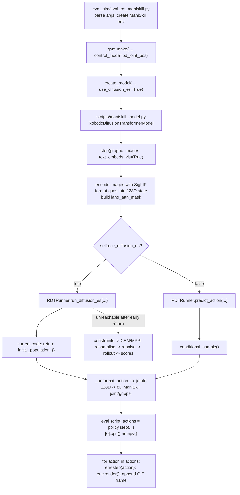

# RDT Diffusion-ES Guidance Analysis

**Date:** 2026-06-06
**Worktree:** `.worktrees/feat/rdt_ed_steering_integration`
**Reference code:** `third_party/RoboticsDiffusionTransformer-diffusion-es`
**Scope:** Static, code-grounded analysis of how the `diffusion-es` branch attempts to route RDT ManiSkill inference through a Diffusion-ES-style action steering path.
**Constraint:** Documentation only. No third-party source or runtime code was modified.

---

## 1. Executive Summary

The `diffusion-es` branch adds a `use_diffusion_es` switch to the ManiSkill RDT wrapper and routes `RoboticDiffusionTransformerModel.step()` into `RDTRunner.run_diffusion_es()` when enabled (`scripts/maniskill_model.py:328-350`, `scripts/maniskill_model.py:566-585`). The evaluation script turns this on explicitly with `create_model(..., use_diffusion_es=True)` (`eval_sim/eval_rdt_maniskill.py:75-82`).

The current `run_diffusion_es()` implementation does **not** execute the ES/CEM steering loop. It prepares repeated conditional inputs, loads or samples an initial population, masks it, and then immediately returns `initial_population, {}` (`models/rdt_runner.py:331-389`). Everything after that return, including constraint scoring, resampling, `renoise()`, `rollout()`, best-score reporting, and ED population caching, is unreachable in the current code (`models/rdt_runner.py:391-504`).

As a result, the active path is closer to "population warm-start sampling" than "Diffusion-ES steering." If `use_initial_cache=True` and the hard-coded cache exists, the wrapper returns that cached population. If `use_initial_cache=False`, it returns RDT samples from `conditional_sample()`. No cost/reward is evaluated before returning (`models/rdt_runner.py:345-389`).

The ManiSkill action path is: `trajectory` in RDT's 128D unified action space -> `_unformat_action_to_joint()` selects `MANISKILL_INDICES` and denormalizes to 8D Franka joint/gripper action -> `eval_rdt_maniskill.py` takes `[0]` and steps the environment one timestep at a time (`scripts/maniskill_model.py:485-493`, `scripts/maniskill_model.py:598-604`, `eval_sim/eval_rdt_maniskill.py:124-134`).

For VLA-Pilot++ integration, the reusable idea is not the current `run_diffusion_es()` body as-is. The useful pieces are the population-level planning intent, candidate scoring over predicted trajectories, and cache/debug affordances. The integration should happen through existing `RDTSteer` boundaries: `encode_inputs()`, full 128D denoising, particle scoring, FKD/resampling, action decoding, and visualization candidates (`core/rdt_policy_steer.py:321-492`, `core/rdt_policy_steer.py:1052-1120`, `core/rdt_policy_steer.py:1199-1309`, `core/rdt_policy_steer.py:1349-1376`).

---

## 2. Call Graph

Key evidence:

- ManiSkill env creation uses `obs_mode=args.obs_mode`, `control_mode="pd_joint_pos"`, `render_mode=args.render_mode`, dense reward by default, and shader/sim backend config (`eval_sim/eval_rdt_maniskill.py:55-66`).
- The ED path is enabled by `use_diffusion_es=True` in `create_model()` (`eval_sim/eval_rdt_maniskill.py:75-82`).
- The wrapper branches on `self.use_diffusion_es` inside `step()` (`scripts/maniskill_model.py:566-596`).
- The active `run_diffusion_es()` path returns before any ES loop (`models/rdt_runner.py:388-389`).

---

## 3. Dataflow Map

| Stage | Code | Data / shape | Semantics |
| --- | --- | --- | --- |
| ManiSkill env | `eval_sim/eval_rdt_maniskill.py:55-66` | `obs`, `reward`, `terminated`, `truncated`, `info` | Gymnasium ManiSkill task with `pd_joint_pos` control. |
| Initial render | `eval_sim/eval_rdt_maniskill.py:105-108` | `img = env.render().squeeze(0).numpy()`; `proprio = obs['agent']['qpos'][:, :-1]` | Rendered RGB frame and Franka qpos slice used by RDT. |
| Image history | `eval_sim/eval_rdt_maniskill.py:116-123` | 6 image slots: previous/current rendered image plus `None` camera placeholders | Matches config with 2 history frames x 3 camera slots (`configs/base.yaml:1-10`). |
| Language | `eval_sim/eval_rdt_maniskill.py:47-88` | cached or newly encoded `text_embed` | Task prompt from `task2lang`, encoded by wrapper T5 path. |
| Wrapper image encoding | `scripts/maniskill_model.py:517-552` | stacked PIL-preprocessed image tensor -> SigLIP features -> `(1, img_len, hidden)` | `None` slots become image-mean background (`scripts/maniskill_model.py:509-521`). |
| Proprio formatting | `scripts/maniskill_model.py:452-483`, `scripts/maniskill_model.py:554-559` | qpos -> normalized 128D state and mask | Fills `MANISKILL_INDICES` with normalized 8D Franka state. |
| RDT conditions | `models/rdt_runner.py:125-137`, `models/rdt_runner.py:331-343` | adapted language/image/state tokens, repeated by population size | Converts token dimensions to RDT hidden size and duplicates one context over candidate population. |
| Active ED return | `models/rdt_runner.py:345-389` | `(population_size, 64, 128)` | Initial population only; no score-guided modification. |
| Action decode | `scripts/maniskill_model.py:485-493`, `scripts/maniskill_model.py:598-604` | `(B, 64, 128)` -> `(B, 64, 8)` float32 | Selects `MANISKILL_INDICES`, denormalizes with `DATA_STAT['action_min/max']`. |
| Env execution | `eval_sim/eval_rdt_maniskill.py:124-134` | `policy.step(...)[0]`, then per-step `env.step(action)` | Chooses first returned candidate/population member and executes each predicted action. |
| Video/GIF | `eval_sim/eval_rdt_maniskill.py:130-170` | rendered frames -> GIF on first success or last failure | Environment execution visualization, separate from EEF trajectory plot. |

---

## 4. Entry and Switch Analysis

### 4.1 Evaluation Script

`eval_sim/eval_rdt_maniskill.py` is a script-style entrypoint: it parses CLI args at import/runtime and immediately creates the environment and policy (`eval_sim/eval_rdt_maniskill.py:16-36`, `eval_sim/eval_rdt_maniskill.py:55-82`). It is not a library-safe `main()` function.

The ManiSkill environment is configured as follows:

- `env_id = args.env_id`, default `PushCube-v1` (`eval_sim/eval_rdt_maniskill.py:18`, `eval_sim/eval_rdt_maniskill.py:55-57`).
- `obs_mode=args.obs_mode`, default `rgb` (`eval_sim/eval_rdt_maniskill.py:19`, `eval_sim/eval_rdt_maniskill.py:58`).
- `control_mode="pd_joint_pos"` (`eval_sim/eval_rdt_maniskill.py:59`).
- `render_mode=args.render_mode`, default `rgb_array` (`eval_sim/eval_rdt_maniskill.py:24`, `eval_sim/eval_rdt_maniskill.py:60`).
- reward is dense unless `--reward-mode` is set (`eval_sim/eval_rdt_maniskill.py:61`).
- shader and sim backend are passed into sensor/human/viewer configs (`eval_sim/eval_rdt_maniskill.py:62-65`).

The policy is created with the reference config and hard-coded model roots:

- `config_path = '/home/zhuoli/RoboticsDiffusionTransformer/configs/base.yaml'` (`eval_sim/eval_rdt_maniskill.py:68-70`).
- text encoder: `google/t5-v1_1-xxl`; vision encoder: `google/siglip-so400m-patch14-384` (`eval_sim/eval_rdt_maniskill.py:71-72`).
- fine-tuned model path comes from CLI default `/home/zhuoli/RoboticsDiffusionTransformer/mp_rank_00_model_states.pt` (`eval_sim/eval_rdt_maniskill.py:27-28`, `eval_sim/eval_rdt_maniskill.py:73`).
- ED is enabled explicitly through `use_diffusion_es=True` (`eval_sim/eval_rdt_maniskill.py:75-82`).

### 4.2 Wrapper Switch

`scripts/maniskill_model.py::create_model()` constructs `RoboticDiffusionTransformerModel` and loads weights if `pretrained` is not `None` (`scripts/maniskill_model.py:29-33`).

`RoboticDiffusionTransformerModel.__init__()` accepts `use_diffusion_es` and `diffusion_es_kwargs`. If `use_diffusion_es` is not provided, it reads `args["common"]["use_diffusion_es"]` with default `False`; otherwise it stores the explicit bool (`scripts/maniskill_model.py:320-350`). The eval script passes `True`, so `self.use_diffusion_es` is active.

Inside `step()`, the branch is direct:

- If `self.use_diffusion_es`, build `es_kwargs`, merge `self.diffusion_es_kwargs`, call `self.policy.run_diffusion_es(**es_kwargs)`, and store `planning_info` (`scripts/maniskill_model.py:566-585`).
- Else, call `self.policy.predict_action(...)` and clear `last_planning_info` (`scripts/maniskill_model.py:587-596`).

This means ED is selected at wrapper construction time, not dynamically per action chunk in the eval script.

---

## 5. RDT Inference Input Flow

### 5.1 Language

The script maps ManiSkill task IDs to fixed natural-language prompts (`eval_sim/eval_rdt_maniskill.py:47-53`). It then loads `text_embed_{env_id}.pt` if present, or calls `policy.encode_instruction(task2lang[env_id])` and caches the resulting embedding (`eval_sim/eval_rdt_maniskill.py:84-88`).

`encode_instruction()` tokenizes the string, runs the T5 text encoder, and returns `last_hidden_state` (`scripts/maniskill_model.py:430-450`). In `step()`, the embedding is moved to model device/dtype and paired with an all-true language attention mask (`scripts/maniskill_model.py:561-564`).

### 5.2 Images

The eval loop keeps a two-frame render history in `obs_window` (`eval_sim/eval_rdt_maniskill.py:100-108`, `eval_sim/eval_rdt_maniskill.py:116-123`). For each frame in the two-frame window, it appends one real image and two `None` placeholders, creating six image slots (`eval_sim/eval_rdt_maniskill.py:117-123`). This matches `img_history_size=2` and `num_cameras=3` in `configs/base.yaml:1-10`.

In the wrapper, each image slot is converted into a PIL/image tensor. `None` slots become a background image filled with the SigLIP processor mean color (`scripts/maniskill_model.py:509-521`). Images are padded to square when `image_aspect_ratio == "pad"` (`scripts/maniskill_model.py:532-546`), stacked, encoded by `SiglipVisionTower`, flattened to token sequence, and unsqueezed to batch size 1 (`scripts/maniskill_model.py:549-552`).

### 5.3 Proprio / State

The eval loop sets `proprio = obs['agent']['qpos'][:, :-1]` after reset and after every env step (`eval_sim/eval_rdt_maniskill.py:105-108`, `eval_sim/eval_rdt_maniskill.py:130-134`). The wrapper passes `proprio.to(device).unsqueeze(0)` into `_format_joint_to_state()` (`scripts/maniskill_model.py:554-556`).

`_format_joint_to_state()` normalizes joints with `DATA_STAT['state_min/max']`, creates a zero 128D state tensor, fills `MANISKILL_INDICES`, and builds a matching 128D state mask (`scripts/maniskill_model.py:452-483`). `MANISKILL_INDICES` are the seven right-arm joint positions plus `right_gripper_open` (`models/kinematics_utils.py:6-10`). The same file defines 8D state/action min/max values (`models/kinematics_utils.py:12`).

### 5.4 Conditions Inside RDTRunner

`RDTRunner` creates language, image, and state adaptors to project modality-specific token dimensions into the RDT hidden size (`models/rdt_runner.py:51-67`). It also constructs three schedulers: training DDPM, inference DPMSolver, and a DDIM scheduler named `diffusion_es_scheduler` (`models/rdt_runner.py:69-94`).

`run_diffusion_es()` concatenates state and action mask, adapts conditions, and repeats the single context by `population_size` (`models/rdt_runner.py:331-343`). It explicitly rejects `base_batch != 1`, so current ED planning only supports one environment/context per call (`models/rdt_runner.py:318-322`).

---

## 6. `run_diffusion_es()` Current Execution Path

The implemented function signature suggests a population planner:

- `population_size=16`
- `use_cem=False`
- `cem_iters=20`
- `num_elites=32`
- `temperature=0.1`
- optional initial and ED population cache paths
- optional `constraints` callable (`models/rdt_runner.py:278-298`)

The docstring says it will "Run diffusion-es planning with RDT-1B proposals as warm starts" and return action predictions plus metadata (`models/rdt_runner.py:299-316`). That docstring is not true for the current active path.

Actual path:

1. Validate one context sample and positive population size (`models/rdt_runner.py:318-326`).
2. If no constraints are provided, create the default constraint function (`models/rdt_runner.py:328-329`). In the active path this constraint is created but never called.
3. Build adapted RDT conditions and repeat them `population_size` times (`models/rdt_runner.py:331-343`).
4. If `use_initial_cache=True`, attempt to load `initial_population_cache`; if loaded, validate tensor type and exact shape `(population_size, pred_horizon, action_dim)` (`models/rdt_runner.py:345-363`).
5. If `use_initial_cache=False`, generate candidates by calling `conditional_sample()` over the repeated population batch (`models/rdt_runner.py:365-373`).
6. Optionally save the initial population cache (`models/rdt_runner.py:375-385`).
7. Apply the action mask and immediately return `initial_population, {}` (`models/rdt_runner.py:388-389`).

Important consequences:

- No `population_scores` are computed in the active path (`models/rdt_runner.py:388-395`).
- No CEM/MPPI resampling runs (`models/rdt_runner.py:397-423`).
- No `rollout()` denoise-after-renoise pass runs (`models/rdt_runner.py:425-436`).
- No best-score selection is made before returning (`models/rdt_runner.py:480-504`).
- `planning_info` is always `{}` in the active ED path, because the return statement supplies an empty dict (`models/rdt_runner.py:388-389`, `scripts/maniskill_model.py:584-585`).

There is also a cache-path fragility: `scripts/maniskill_model.py` sets `use_initial_cache=True` and hard-codes `/home/zhuoli/RoboticsDiffusionTransformer/eval_sim/finetune_population_16_2.pt` (`scripts/maniskill_model.py:574-580`). If that file does not exist, the `if cache_path.exists()` body is skipped and `initial_population` is never assigned before `initial_population * action_mask` (`models/rdt_runner.py:346-363`, `models/rdt_runner.py:388`). If cache loading fails and sets `initial_population = None`, the mask multiplication will also fail (`models/rdt_runner.py:361-363`, `models/rdt_runner.py:388`).

---

## 7. Diffusion-ES Intended Steering Mechanism

This section describes the apparent design in the unreachable code, not what the current runtime executes.

### 7.1 Population Initialization

The intended warm start is either a cached initial population or samples generated by `conditional_sample()` (`models/rdt_runner.py:345-373`). `conditional_sample()` starts from Gaussian noise shaped `(B, pred_horizon, action_dim)`, runs the inference scheduler timesteps, calls the RDT model at each step, and masks invalid dimensions at the end (`models/rdt_runner.py:139-182`).

In `predict_action()`, the reference code hard-codes `sampling_batch_size = 32`, repeats the context, and returns all sampled action candidates (`models/rdt_runner.py:241-276`). In `run_diffusion_es()`, the equivalent candidate count is `population_size`, default 16 (`models/rdt_runner.py:278-298`, `models/rdt_runner.py:338-343`).

### 7.2 Constraint Scoring

The unreachable code would evaluate `constraints(population_trajectories)` immediately after initialization (`models/rdt_runner.py:391-395`). If no constraint was supplied, `generate_constraints()` returns `constraint_fn_lower` (`models/rdt_runner.py:609-664`).

Both included constraints convert 128D action trajectories into EEF trajectories:

- `process_trajectory()` asserts input shape `(B, T, 128)`, selects `MANISKILL_INDICES`, denormalizes with `DATA_STAT['action_min/max']`, takes the first seven joint dimensions, calls `franka_fk_fn()`, and returns `(B, T, 3)` EEF positions (`models/rdt_runner.py:575-607`).
- `franka_fk_fn()` constructs a Panda model and loops over batch/time joint states, using `fkine(q)` and extracting translation (`models/kinematics_utils.py:15-30`).

The point constraint uses a hard-coded `plate_position = [0.25, -0.2, -0.3]` and `safe_distance = 0.001`, then returns a tensor called `scores` (`models/rdt_runner.py:615-639`). The lower constraint scores the EEF height change using initial and final z values and returns `constraint_fn_lower` as the default (`models/rdt_runner.py:641-664`).

### 7.3 Resampling / RENOISE / Rollout

The unreachable loop builds `trunc_step_schedule = np.linspace(5, 1, cem_iters).astype(int)` and iterates `cem_iters` times (`models/rdt_runner.py:397-401`).

Each iteration:

- Converts scores into probabilities with `torch.exp(temperature * -population_scores)` and normalizes them (`models/rdt_runner.py:403-409`).
- If `use_cem`, selects elites via `torch.argsort(population_scores)[:num_elites]`, samples elite indices, and calls `renoise()` (`models/rdt_runner.py:414-418`).
- Else, samples indices from `probs`, reindexes the population, and calls `renoise()` (`models/rdt_runner.py:419-423`).
- Calls `rollout()` to denoise for the truncated timesteps and rescore (`models/rdt_runner.py:425-436`).

`rollout()` concatenates noisy action and action mask, adapts state/action tokens, calls the RDT model over selected timesteps, steps the scheduler, masks invalid action dimensions, and evaluates constraints again (`models/rdt_runner.py:511-558`). `renoise()` adds scheduler noise at a selected timestep (`models/rdt_runner.py:570-573`).

### 7.4 Intended Metadata and Cache

After the loop, the code would print planning time and score stats, optionally save the ED population cache, and return `population_trajectories` plus metadata containing population, scores, best score, and elapsed time (`models/rdt_runner.py:480-504`).

Even this intended path does not explicitly return the best trajectory. It returns the whole population (`models/rdt_runner.py:504`). Downstream, `eval_rdt_maniskill.py` uses `policy.step(...)[0]`, so it would execute the first candidate unless the returned population had already been reordered with the best first (`eval_sim/eval_rdt_maniskill.py:124-130`). The current unreachable loop does not perform a final "best first" reorder before returning (`models/rdt_runner.py:480-504`).

### 7.5 Experimental / Non-Reusable Parts

The following are hard-coded or fragile:

- Absolute paths in the eval script and wrapper (`eval_sim/eval_rdt_maniskill.py:68-74`, `scripts/maniskill_model.py:574-580`).
- `use_initial_cache=True` by default in the ED wrapper branch, with no fallback when cache is absent (`scripts/maniskill_model.py:574-580`, `models/rdt_runner.py:346-389`).
- Default `num_elites=32` is larger than default `population_size=16`; if `use_cem=True`, `torch.randint(0, num_elites, ...)` can sample beyond the actual elite tensor length (`models/rdt_runner.py:288-292`, `models/rdt_runner.py:414-418`).
- Constraint functions contain stale bimanual/left-arm comments but operate on single-arm ManiSkill indices and Franka FK (`models/rdt_runner.py:615-623`, `models/rdt_runner.py:625-639`, `models/kinematics_utils.py:6-30`).
- Visualization colors are random, not distance-based, because `scores = np.random.uniform(0.8, 1, ...)` replaces the distance score (`scripts/maniskill_model.py:185-190`).
- The plotting target is hard-coded to `[-0.33, -0.20, -0.08]` (`scripts/maniskill_model.py:180-184`).

---

## 8. Action Return, Execution, and Visualization

### 8.1 RDT 128D to ManiSkill 8D

Both `run_diffusion_es()` and `predict_action()` produce trajectories in the 128D RDT action/state space before wrapper decoding. The wrapper then calls `_unformat_action_to_joint()`:

- Selects `MANISKILL_INDICES` from the 128D tensor (`scripts/maniskill_model.py:485-487`).
- Denormalizes with `self.action_min/max` (`scripts/maniskill_model.py:489-492`).
- Returns 8D Franka joint/gripper actions (`scripts/maniskill_model.py:493`).

The final `trajectory` is converted to `torch.float32`, optionally plotted, and returned (`scripts/maniskill_model.py:598-604`).

### 8.2 Candidate Selection in Eval Script

`policy.step(proprio, images, text_embed, vis=True)[0].cpu().numpy()` selects the first batch/population member (`eval_sim/eval_rdt_maniskill.py:124-125`). The script then iterates over every timestep in that action chunk and sends each 8D action into `env.step(action)` (`eval_sim/eval_rdt_maniskill.py:128-134`).

The comment says RDT was trained to predict interpolated 64 steps and suggests `actions = actions[::4, :]`, but that line is commented out (`eval_sim/eval_rdt_maniskill.py:126-127`). Therefore the script currently executes all predicted chunk steps unless the episode terminates or truncates.

### 8.3 Environment Render vs EEF Plot

There are two visualization paths:

1. Environment visualization: after each `env.step(action)`, the script calls `env.render()`, appends the frame to `video_frames`, and saves a GIF on first success or final failure (`eval_sim/eval_rdt_maniskill.py:130-170`). This shows actual ManiSkill execution.
2. EEF trajectory plotting: `step(vis=True)` calls `eef_trajs_visualization(trajectory, franka_fk_fn)` before returning actions (`scripts/maniskill_model.py:600-604`). This plots predicted joint trajectories in FK-derived EEF space, not executed environment frames (`scripts/maniskill_model.py:171-312`).

These two visualizations can diverge. The EEF plot is based on predicted trajectories and a local Panda FK model (`scripts/maniskill_model.py:171-178`, `models/kinematics_utils.py:15-30`). The GIF is based on simulator execution after `env.step()` (`eval_sim/eval_rdt_maniskill.py:128-134`).

---

## 9. Mismatches Between Names, Comments, and Actual Behavior

1. `run_diffusion_es()` name/docstring implies ED planning, but current execution returns initial population before any scoring or resampling (`models/rdt_runner.py:299-316`, `models/rdt_runner.py:388-389`).
2. `planning_info` sounds meaningful, but the active ED path returns `{}` (`models/rdt_runner.py:388-389`, `scripts/maniskill_model.py:584-585`).
3. `constraints` are constructed by default but never used in the active path (`models/rdt_runner.py:328-329`, `models/rdt_runner.py:388-389`).
4. Constraint docstrings mention bimanual or left-arm trajectories, but code processes 128D RDT trajectories through single-arm `MANISKILL_INDICES` and Franka FK (`models/rdt_runner.py:615-623`, `models/rdt_runner.py:575-607`, `models/kinematics_utils.py:6-30`).
5. The visualization function computes distances to a target but assigns random display scores, so color does not represent constraint quality (`scripts/maniskill_model.py:185-190`).
6. If ED were made reachable, the function still returns the full population, while the eval script executes candidate 0; no code guarantees candidate 0 is the best (`models/rdt_runner.py:480-504`, `eval_sim/eval_rdt_maniskill.py:124-130`).

---

## 10. Relation to VLA-Pilot++ `core/rdt_policy_steer.py`

The current VLA-Pilot++ RDT path is structurally different from the third-party `run_diffusion_es()` experiment.

### 10.1 Existing VLA-Pilot++ Interfaces

`RDTSteer` wraps a real `RoboticDiffusionTransformerModel` in `_RDTModelAdapter`, which exposes `encode_inputs()`, a DiT adapter, and an inference scheduler (`core/rdt_policy_steer.py:321-342`). `encode_inputs()` runs the same kind of image/text/state preparation once, validates 128D state/mask contracts, builds the 128D action mask, and returns a conditioning dict for the denoising loop (`core/rdt_policy_steer.py:381-492`).

The unguided path samples full 128D latent/actions with scheduler denoising and masks invalid action dimensions (`core/rdt_policy_steer.py:1014-1048`). The guided path samples a particle batch in full 128D space, calls `_guided_denoise_loop()`, then masks invalid action dimensions (`core/rdt_policy_steer.py:1052-1120`).

`_guided_denoise_loop()` already contains the pieces that third-party Diffusion-ES was reaching for:

- population/particle batch through `B = max(1, sample_batch_size)` (`core/rdt_policy_steer.py:1085-1096`);
- diversity gradient on early timesteps (`core/rdt_policy_steer.py:1240-1248`);
- keypoint reward gradient on later timesteps (`core/rdt_policy_steer.py:1249-1268`);
- optional FKD resampling (`core/rdt_policy_steer.py:1226-1234`, `core/rdt_policy_steer.py:1278-1287`);
- best-particle selection for execution (`core/rdt_policy_steer.py:1294-1309`, `core/rdt_policy_steer.py:1311-1325`);
- ordered visualization candidates (`core/rdt_policy_steer.py:1300-1308`, `core/rdt_policy_steer.py:1327-1355`).

Action postprocessing is centralized in `_postprocess_actions()`, which expects `(B, 64, 128)` and decodes the first particle into `(1, H, 7)` LIBERO raw actions (`core/rdt_policy_steer.py:1359-1376`). The underlying converter uses `LIBERO_ACTION_INDICES = [39, 40, 41, 42, 43, 44, 10]`, binarizes gripper, and decodes the first particle and configured horizon (`core/rdt_libero_action_converter.py:6-14`, `core/rdt_libero_action_converter.py:31-62`).

### 10.2 Existing Observation Boundary

VLA-Pilot++ does not feed ManiSkill `obs['agent']['qpos']`. It uses `RDTLiberoObsProcessor` to build the six image slots, a 128D state, a 128D state mask, and task string from LIBERO observations (`core/rdt_libero_obs_processor.py:42-114`). It validates image dtype/shape, optional flip undo, joint shape `(7,)`, gripper shape `(2,)`, and active indices (`core/rdt_libero_obs_processor.py:116-161`).

This matters because the third-party reference path is ManiSkill-specific: it uses `MANISKILL_INDICES`, `DATA_STAT`, and `pd_joint_pos` joint actions (`models/kinematics_utils.py:6-12`, `eval_sim/eval_rdt_maniskill.py:55-66`). Current VLA-Pilot++ RDT-LIBERO uses LIBERO action slots and LIBERO environment step semantics (`core/rdt_libero_action_converter.py:6-14`, `core/env_adapters/libero_adapter.py:1527-1601`, `core/env_adapters/libero_adapter.py:1604-1632`).

### 10.3 Integration Boundary

The clean integration boundary is not "call third-party `run_diffusion_es()` from `RDTSteer`." That would import ManiSkill-specific state/action semantics, cache paths, and an inactive ED loop into a LIBERO path.

The better boundary is:

- keep `_RDTModelAdapter.encode_inputs()` as the only RDT conditioning entrypoint (`core/rdt_policy_steer.py:381-492`);
- keep full 128D sampling in `_predict_guided()` / `_guided_denoise_loop()` (`core/rdt_policy_steer.py:1052-1120`, `core/rdt_policy_steer.py:1199-1309`);
- if adopting ED-style ideas, add them as a particle planner/resampler module operating on `(B, 64, 128)` tensors and a reward function compatible with `_score_particles()` (`core/rdt_policy_steer.py:1148-1167`);
- return either a single selected `(1, 64, 128)` particle or an explicitly ordered population whose first element is best, before `_postprocess_actions()` (`core/rdt_policy_steer.py:1294-1325`, `core/rdt_policy_steer.py:1359-1376`).

---

## 11. Reusable Components

The following ideas/components are reusable with adaptation:

- Population warm-start from RDT denoising candidates (`models/rdt_runner.py:365-373`).
- Candidate scoring API shape: `constraints(trajectories) -> (scores, info)` (`models/rdt_runner.py:287-311`, `models/rdt_runner.py:394-395`).
- RENOISE + short denoise rollout as a mutation operator (`models/rdt_runner.py:511-558`, `models/rdt_runner.py:570-573`).
- Cache/debug concept for initial and post-ED populations, but not the hard-coded paths (`models/rdt_runner.py:293-297`, `models/rdt_runner.py:375-385`, `models/rdt_runner.py:485-495`).
- EEF trajectory visualization as a diagnostic, with corrected score coloring and nonblocking save-to-file mode (`scripts/maniskill_model.py:171-312`).

---

## 12. Code That Should Not Be Copied Directly

- The active `return initial_population, {}` path, because it bypasses steering (`models/rdt_runner.py:388-389`).
- Hard-coded cache/config/checkpoint paths under `/home/zhuoli/...` (`eval_sim/eval_rdt_maniskill.py:68-74`, `scripts/maniskill_model.py:574-580`).
- ManiSkill `MANISKILL_INDICES` and `DATA_STAT` for LIBERO-finetuned or LIBERO runtime paths (`models/kinematics_utils.py:6-12`, `core/rdt_libero_action_converter.py:6-14`).
- Constraint functions with hard-coded target points and stale bimanual comments (`models/rdt_runner.py:615-664`).
- Visualization random scores and blocking `plt.show()` in a rollout loop (`scripts/maniskill_model.py:185-190`, `scripts/maniskill_model.py:311-312`).
- Population return without explicit best selection or best-first ordering (`models/rdt_runner.py:480-504`, `eval_sim/eval_rdt_maniskill.py:124-130`).

---

## 13. Must-Fix Issues Before Using the Reference ED Path

1. Remove or gate the early return so the intended ES loop is reachable (`models/rdt_runner.py:388-389`).
2. Add robust fallback when `use_initial_cache=True` but cache is missing or invalid (`models/rdt_runner.py:346-363`).
3. Ensure `num_elites <= population_size` or clamp elite sampling (`models/rdt_runner.py:288-292`, `models/rdt_runner.py:414-418`).
4. Set scheduler timesteps consistently for `rollout()` / `renoise()` before indexing scheduler timesteps (`models/rdt_runner.py:511-558`, `models/rdt_runner.py:570-573`).
5. Define and document score sign: current code uses lower scores as better in sorting/probabilities, but constraint functions mix negative and positive transformations (`models/rdt_runner.py:407-423`, `models/rdt_runner.py:633-662`).
6. Return a selected best trajectory or explicitly reorder population best-first before downstream `[0]` selection (`models/rdt_runner.py:480-504`, `eval_sim/eval_rdt_maniskill.py:124-130`).
7. Replace hard-coded constraints with caller-provided reward functions or task-specific adapters (`models/rdt_runner.py:328-329`, `models/rdt_runner.py:609-664`).
8. Make plotting optional, nonblocking, and score-faithful (`scripts/maniskill_model.py:171-312`).

---

## 14. Recommended Integration Plan for VLA-Pilot++

1. Treat Diffusion-ES as a planner strategy behind `RDTSteer`, not as a new wrapper-level policy. `RDTSteer.select_action()` already centralizes chunk generation, caching, guidance switch, and postprocessing (`core/rdt_policy_steer.py:940-1010`).
2. Reuse `encode_inputs()` and `_RDTDiTAdapter.forward()` for all RDT model calls. They already bridge 128D unified action space and model conditioning (`core/rdt_policy_steer.py:217-318`, `core/rdt_policy_steer.py:381-492`).
3. Define an ED planner interface around `(x_t, cond, scheduler, reward_fn, action_mask) -> selected_or_ordered_samples`. This can sit near `_guided_denoise_loop()` and use `_score_particles()` as the reward boundary (`core/rdt_policy_steer.py:1148-1167`, `core/rdt_policy_steer.py:1199-1309`).
4. Keep action decoding through `decode_rdt_libero_action_chunk()`, not ManiSkill `_unformat_action_to_joint()` (`core/rdt_libero_action_converter.py:45-62`, `scripts/maniskill_model.py:485-493`).
5. Keep visualization candidates through `_decode_visualization_action_candidates()` / `get_last_visualization_action_candidates()` so existing main/visualization code can consume ordered particles (`core/rdt_policy_steer.py:926-929`, `core/rdt_policy_steer.py:1300-1308`, `core/rdt_policy_steer.py:1349-1355`).
6. If ED uses EEF trajectory rewards, fix the trajectory projection semantics first. Current `RDTSteer._rdt_sample_to_trajectory_3d()` decodes selected action slots and then calls `adapter.delta_actions_to_ee_trajectory()` (`core/rdt_policy_steer.py:1380-1402`), while LIBERO's adapter explicitly interprets actions as normalized delta EEF pose (`core/env_adapters/libero_adapter.py:1542-1591`). Any ED reward must use the same action semantics as the decoded runtime action.

---

## 15. Suggested Tests

Minimum tests before adopting ED-style guidance:

- Static test that `run_diffusion_es()` no longer returns before scoring when ED is enabled; assert constraints are called at least once.
- Cache-miss test for `use_initial_cache=True`; it should fall back to sampling or raise a clear `FileNotFoundError`, not hit an unbound variable (`models/rdt_runner.py:346-389`).
- Population selection test: when rewards rank candidate 2 best, returned execution candidate should be candidate 2 or population should be best-first (`models/rdt_runner.py:480-504`, `eval_sim/eval_rdt_maniskill.py:124-130`).
- Score-sign test for the default constraint or any VLS reward bridge (`models/rdt_runner.py:407-423`, `models/rdt_runner.py:615-664`).
- Shape contract test for `(B, 64, 128)` through ED planner and `(1, H, 7)` through `_postprocess_actions()` (`core/rdt_policy_steer.py:1359-1376`, `core/rdt_libero_action_converter.py:45-62`).
- Existing VLA-Pilot++ tests already cover guided particle batch, FKD init/resampling, visualization candidate cache, and best-first visualization ordering (`tests/test_rdt_steer.py:396-471`, `tests/test_rdt_steer.py:553-609`, `tests/test_rdt_steer.py:612-668`).

---

## 16. Bottom Line

The `diffusion-es` branch contains a useful sketch for population-based RDT action steering, but the active implementation currently does not perform Diffusion-ES steering. It returns an initial population before any reward/cost loop. For VLA-Pilot++, the right path is to borrow the planner idea, not the current wrapper code: implement ED-style resampling/mutation behind `RDTSteer`'s existing full-128D guided denoising and particle scoring interfaces, keep LIBERO-specific action decoding, and require explicit best-particle selection before execution.
